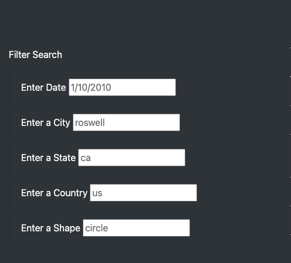

# UFOs

[link to the Finding UFOs page](https://nickku1223.github.io/UFOs/)

# Overview of the project:
This project is to build a webpage where user can use filter to find UFO sightings data. In order to build this webpage, we incorporate HTML, JavaScript, CSS and Bootstrap to make a simple webpage for users to look for the data, and by using keywords filters, the users can easily find the pieces of information they desired.

# Results
The page is fairly simple to navigate, on left side we can see different filters that the user can enter to filter out the data that they want to retrieve.

The user can enter the one or multiple filters to apply the filter. For example, the user can use just the "date" filter to search for certain date of data, or they can combine the "date", "city" together to look for the data they wish to see. When finish entering filters, just simply press enter and the filter(s) will be applied, the data will be showing on the page.

If after the user wish to return to the default table of data, they can simply clear the filters and press enter, the default data will be displayed when no filter is applied.

# Summary
The page is simple and pretty straight forward to use. But one thing can be confusing for the user is that there are not button to click, and the filter doesnt automatically applied, if with no instruction, the user might not know that in order to apply the filter, they will need to press enter. And the filter that the user need to enter will also need to match exactly how it is in the dataset, for example, the "State" filter if they enter "CA" instead of "ca", the data will not show up.

So this is something that we can add to the webpage, when the filter is entered, the data table will automatically showing the filtered data! Also for the filter to ignore case, so the users could enter capitalized letter and still can find the data they desired to see.

The filters can potential be frustrating for the users, since they will have to enter the filter themselves, and there's no guarantee that a user who's not fimilar with the dataset will be able to enter the right filter. A way to help user to easily access to the data is instead of asking user to enter the data, we can create a drop down menu for them to choose for the filters.
